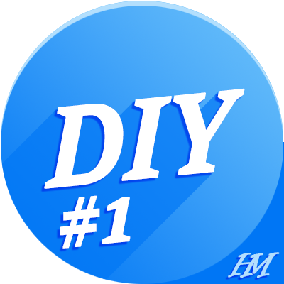
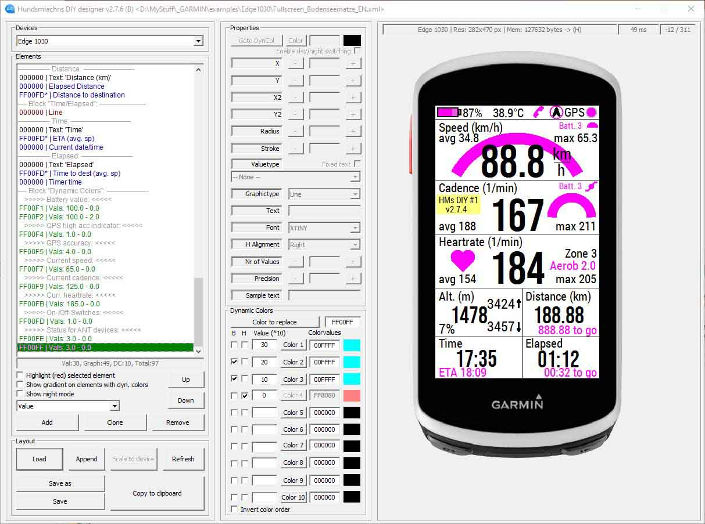
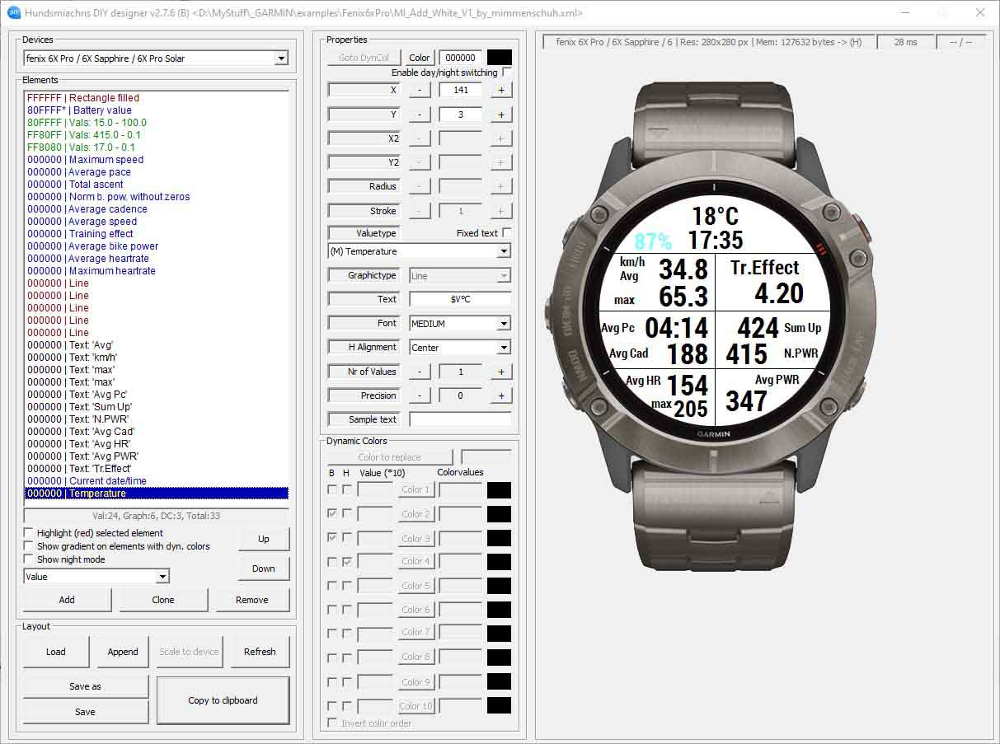
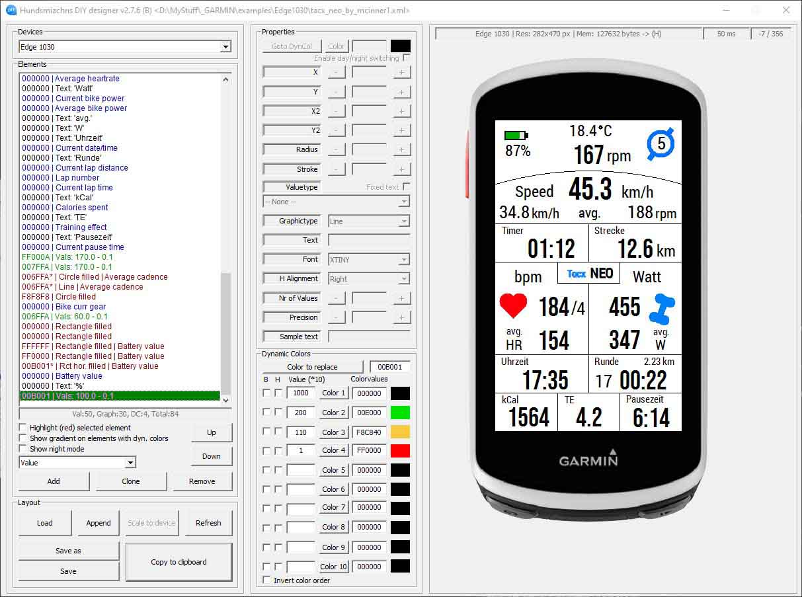
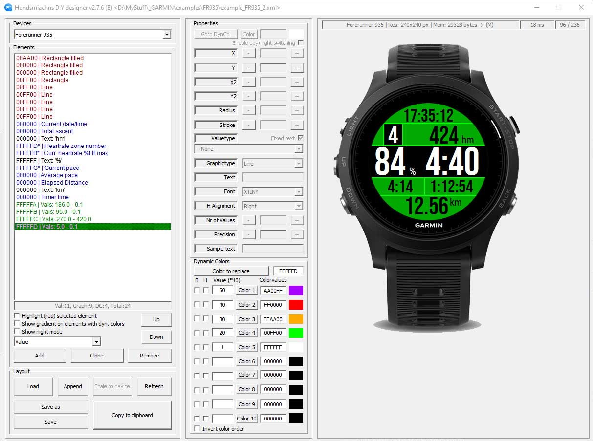

##  ConnectIQ HMs DIY #1-6


Welcome to hundsmiachn's datafield designer aka "HMs DIY #1-6".

With this software you can create custom datafield layouts for compatible Garmin devices. The WYSIWYG-designer creates a configuration string which you can import into the homonymous Connect IQ extension on your device.

To create a layout, download the latest designer version <a href="./designer_software_and_manuals/">here</a>. (Windows platform supported only)

Instructions about how to use the designer software can be found in the manual, which is included in the downloaded ZIP file.

If you are happy with any of the example layouts contributed by other users, there is no need to download the designer. You can simply <a href="#start_simple">download the config string</a> and import it into the Connect IQ extension. Or read more information about <a href="#start_expert">designing your own layouts</a>.

Please note: There are 6 extensions in the <a target="_blank" href="https://apps.garmin.com/en-US/apps/b0346b71-bf01-4070-96d6-3de66dcc8233">Connect IQ store (HMs DIY #1-6)</a>, because one extension can import only one datafield layout. Some users may want to configure/load different datafields on one device.

You can  <a href="#howto_contribute">contribute to this project</a> by providing your device-specific layouts, screenshots font adjustments. Please also read <a href="#contribute_conversations">guidelines</a> before reporting bug reports (issues), starting conversations (discussions) or posting feature requests.

Because I want to keep this datafield and the app free for use I would be very grateful about a small donation to paypal.me/ErichJarz. You can also use the Donate-button above.








### TOC - table of contents


[1. What you will find here](#what_find_here)<br />
[2. Filesystem structure](#filesystem_structure)<br />
[3. Files you need to start](#files_need_to_start)<br />
&nbsp;&nbsp;&nbsp;&nbsp;[3.1. I'm happy with example layouts found here](#start_simple)<br />
&nbsp;&nbsp;&nbsp;&nbsp;[3.2. I want to modify an existing or create my own layout](#start_expert)<br />
[4. Links and resources](#links_resources)<br />
[5. How to contribute to this project](#howto_contribute)<br />
&nbsp;&nbsp;&nbsp;&nbsp;[5.1. How to contribute with bug reports, discussions and feature requests](#contribute_conversations)<br />
&nbsp;&nbsp;&nbsp;&nbsp;[5.2. How to contribute with datafield layouts and images](#contribute_layouts)<br />
&nbsp;&nbsp;&nbsp;&nbsp;[5.3. How to contribute with new devices (font configuration)](#contribute_fontconfig)<br />
[6. List of compatible Garmin devices](#compatible_devices)<br />
[7. List of available metrics](#available_metrics)<br />


<a name="what_find_here">

### 1. What you will find in this repository

</a>

designer-related files:
- designer software releases (latest and historic versions; ZIP packages including:)
	- Windows executable binaries
	- manuals (ENG, GER)
	- release notes
- changelog
- designer screenshots

designer-related documentation:
- links to relevant websites and resources
- list of compatible Garmin devices
- list of available metrics
- known bugs
- roadmap

device-specific files:
- adjustments to fonts.txt
- layouts for font-adjustments and testing
- layouts for datafields, including
	- designer previews of customized datafields
	- device screenshots
	- config strings (for import into Garmin Express or Garmin Connect / ConnectIQ apps without the need of using the designer)


<a name="filesystem_structure"/>

### 2. Filesystem structure

</a>

The filesystem structure of this repository basically separates between the offering of the app developer (designer app, documentation, few examples) and user-generated, device-specific content (font adjustment, datafields config files, config strings an preview pictures) The filesystem hierarchy also fits to the workflow. If you are <a href="start_simple"/>new in this IQ App and/or the designer</a>, just choose a layout config file (or even easier a config string, if provided). You can then learn to <a href="start_expert"/>modify the layout or to create your own layouts from the ground</a> with the designer software. It would be nice to share your work with other users via this repo. If you are a experienced user, able to adjust the font sizes or even create files and directories for a whole new device, you can <a href="howto_contribute"/>contribute to this project</a> as well.


```
.
├── designer_software_and_manuals
│   ├── HM_DIYD_3.4.1.zip
│   ├── HM_DIYD_3.4.2.zip
│   ├── HM_DIYD_[...].zip (latest)
│   │   └── designer software, manual, example/common font configs
│   └── changelog
├── device_related_user_content
│   ├── devicename abc
│   ├── devicename ...
│   └── devicename xyz
│       ├── datafield layouts
│       │   ├── username01
│       │   ├── username02
│       │   └── username03
│       │       ├── designer previews
│       │       ├── device screeshots
│       │       ├── designer config file(s) (xml)
│       │       └── config string(s) (for direct import into Garmin Express or Connect IQ mobile app)
│       ├── font adjustment layouts
│       │   └── designer config file(s) (xml)
│       └── font config
│           └── font config file(s) (txt)
└── media
    ├── designer_screenshots
    ├── device_pictures
    └── logo
```


<a name="files_need_to_start"/>

### 3. Files you need to start

</a>


<a name="start_simple"/>

#### 3.1. I'm happy with example layouts found here

</a>


<a name="start_expert"/>

#### 3.2. I want to modify an existing or create my own layout

</a>

A good point to start is an existing layout. The downloadable ZIP folder comes with some example files for some common devices. If your device is not included in this examples directory, search for examples in this repository, directory <a href="./device_related_user_content/">./device_related_user_content/</a>. Open some .xml file in the designer, move some elements and learn the rule to customize and place the objects on the screen. Please see the manual for further instructions.

If you want to start with a whole new desing from the ground, you need a few points:

- check that fonts are configured for your device
- define the the screen resolution
- define a background image/color
- ...


<a name="links_resources"/>

### 4. Links and resources

</a>


https://apps.garmin.com/en-US/apps/b0346b71-bf01-4070-96d6-3de66dcc8233


Old forum for questions and discussions (please use :

https://forums.garmin.com/developer/connect-iq/f/showcase/206277/hms-diy-1-6

https://public.stattegg.info/


<a name="howto_contribute">

### 5. How to contribute to this project

</a>


There are several ways for contributions to this project and to thos repository. Here are the rules:
- In any way please keep the provided <a href="#filesystem_structure">filesystem structure</a>
- Don't use spaces in filenames or directory names

<a name="contribute_conversations">

### 5.1. How to contribute with bug reports, discussions and feature requests

</a>

#### a) identify if a bug is located in the designer software, in the HMsDIY app or in the Garmin SDK


- HMs DIY uses the Connect IQ SDK
- most problems are on the SDK side
- contribution by bug reporting to Garmin


#### b) bug reports on designer(HMs DIY bugs)

- search within the repository for your keywords
- search with Google for your keywords (maybe there was already a discussion on that issue in the Connect IQ forum)
- open a new issue


#### c) How to contribute with bug reports (Connect IQ SDK bugs)

- forum post
- https://forums.garmin.com/developer/connect-iq/i/bug-reports


#### d) ...


<a name="contribute_layouts">

### 5.2. How to contribute with datafield layouts and images

</a>

- fork
- (with Git on your local machine)
- code
- testing
- screenshots (designer and device)
- file name conventions (size)
- save to folder
- make documentation
	- make a readme.md with images included by relative paths, so everyone can access preview images easily)
- commit
- pull request (detailed instructions)


- https://docs.github.com/pull-requests/collaborating-with-pull-requests/proposing-changes-to-your-work-with-pull-requests/creating-a-pull-request

- https://docs.github.com/pull-requests/collaborating-with-pull-requests/proposing-changes-to-your-work-with-pull-requests/creating-a-pull-request-from-a-fork


<a name="contribute_fontconfig">

### 5.3. How to contribute with new devices (font configuration)

</a>

- learn basics of font config by RTFM
- use an existing layout for font adjustment or build a new one
- test, modify, repeat


<a name="compatible_devices"/>

### 6. List of compatible Garmin devices

</a>


If your device is not listed here, please check the most current compatibility list in GARMIN connect IQ store:
 
https://apps.garmin.com/en-US/apps/b0346b71-bf01-4070-96d6-3de66dcc8233#compatible-devices

- Approach® S60
- Approach® S62
- Captain Marvel
- D2™ Air
- D2™ Air X10
- D2™ Bravo
- D2™ Bravo Titanium
- D2™ Charlie
- D2™ Delta
- D2™ Delta PX
- D2™ Delta S
- D2™ Mach 1
- Darth Vader™
- Descent™ G1, Descent™ G1 Solar
- Descent™ Mk1
- Descent™ MK2, Descent™MK2i
- Descent™ Mk2S
- Edge® 1000
- Edge® 1030
- Edge® 1030 Plus
- Edge® 1030, Bontrager
- Edge® 1040
- Edge® 130
- Edge® 130 Plus
- Edge® 520
- Edge® 520 Plus
- Edge® 530
- Edge® 820
- Edge® 830
- Edge® Explore
- Edge® Explore 1000
- Edge® Explore 820
- Enduro™
- Enduro™ 2
- epix™ (Gen 2), quatix® 7 – Sapphire Edition
- First Avenger
- ForeAthlete® 230J
- ForeAthlete® 235J
- ForeAthlete® 630J
- ForeAthlete® 735XTJ
- ForeAthlete® 920XTJ
- Forerunner® 230
- Forerunner® 235
- Forerunner® 245
- Forerunner® 245 Music
- Forerunner® 255
- Forerunner® 255 Music
- Forerunner® 255S
- Forerunner® 255S Music
- Forerunner® 55
- Forerunner® 630
- Forerunner® 645
- Forerunner® 645 Music
- Forerunner® 735XT
- Forerunner® 745
- Forerunner® 920XT
- Forerunner® 935
- Forerunner® 945
- Forerunner® 945 LTE
- Forerunner® 955, Forerunner® 955 Solar
- fēnix® 3, quatix® 3, tactix® Bravo
- fēnix® 3 HR
- fēnix® 5, quatix® 5
- fēnix® 5 Plus
- fēnix® 5S
- fēnix® 5S Plus
- fēnix® 5X, tactix® Charlie
- fēnix® 5X Plus
- fēnix® 6
- fēnix® 6 Dual Power
- fēnix® 6 Pro, fēnix® 6 Sapphire
- fēnix® 6 Pro Dual Power
- fēnix® 6 Pro Solar
- fēnix® 6 Solar
- fēnix® 6S
- fēnix® 6S Dual Power
- fēnix® 6S Pro, fēnix® 6S Sapphire
- fēnix® 6S Pro Dual Power
- fēnix® 6S Pro Solar
- fēnix® 6S Solar
- fēnix® 6X Pro, fēnix® 6X Sapphire, fēnix® 6X Pro Solar, tactix® Delta Sapphire, quatix® 6X Solar, tactix® Delta Solar, tactix® Delta Solar Ballistics
- fēnix® 7, quatix® 7
- fēnix® 7S
- fēnix® 7X, quatix® 7X – Solar Edition
- fēnix® Chronos
- GPSMAP® 66i
- GPSMAP® 66s / 66st
- GPSMAP® 66sr
- GPSMAP® 86i
- GPSMAP® 86s
- GPSMAP® 86sc
- GPSMAP® 86sci
- Instinct® 2, Instinct® 2 - Camo Edition, Instinct® 2 Solar - Tactical Edition, Instinct® 2 Solar - Surf Edition, Instinct® 2 - dēzl™ Edition
- Instinct® 2S, Instinct® 2S - Camo Edition, Instinct® 2S Solar - Tactical Edition, Instinct® 2S Solar - Surf Edition, Instinct® 2S - dēzl™ Edition
- MARQ™ Adventurer
- MARQ™ Athlete
- MARQ™ Aviator
- MARQ™ Captain, MARQ™ Captain: American Magic Edition
- MARQ™ Commander
- MARQ™ Driver
- MARQ™ Expedition
- MARQ™ Golfer
- Mercedes-Benz Venu®
- Mercedes-Benz Venu® 2
- Mercedes-Benz Venu® 2S
- Montana 700, Montana 700i, Montana 750i
- Oregon® 7 Series
- quatix® 6
- quatix® 6X, quatix® 6X Solar, quatix® 6X Dual Power
- Rey™
- Rino® 7 Series
- tactix® 7, tactix® 7 – Pro Ballistics Edition, tactix® 7 – Pro Edition
- Venu®
- Venu® 2
- Venu® 2 Plus
- Venu® 2S
- Venu® Sq.
- Venu® Sq. Music
- vívoactive®
- vívoactive® 3
- vívoactive® 3 Mercedes-Benz® Collection
- vívoactive® 3 Music
- vívoactive® 4, GarminActive
- vívoactive® 4S, GarminActive S 


<a name="available_metrics"/>

### 7. List of available metrics

</a>

(*) some metrics not available on all devices


- Name of destination
- Name of next point
- Current date/time
- Timer time
- Current pause time
- Elapsed time
- Last lap time
- Current lap time
- ETA
- Time to dest
- ETA next p
- Time to next p
- Total pause time
- Current pace
- Avg. pace
- Max. pace
- Last lap avg. pace
- Current lap avg. pace
- Avg. pace (elapsed)
- Elapsed Dist.
- Dist. to destination
- Dist. to next point
- Dist. to coordinate
- Current lap Dist.
- Last lap Dist.
- Odometer
- Current speed
- Avg. speed
- Max. speed
- Last lap avg. speed
- Current lap avg. speed
- Avg. speed (elapsed)
- Current cadence
- Avg. cadence
- Max. cadence
- Current bike power
- Avg. bike power
- Max. bike power
- % FTP
- Normalized Power
- Last Lap NP
- Curr Lap NP
- Last Lap avg power
- Curr Lap avg power
- TSS
- Power zone number
- Time in power zone X
- % in power zone X
- Front derailleur index
- Front derailleur max
- Front derailleur size
- Rear derailleur index
- Rear derailleur max
- Rear derailleur size
- ANT BikeCadence *
- ANT BikeSpeedCadence *
- ANT BikeSpeed *
- ANT Shifting *
- ANT BikePower *
- ANT FitnessEquipment *
- ANT RunningDynamics *
- ANT BikeRadar status
- ANT BikeRadar battery
- ANT LightNet status
- ANT LightNet battery
- Current altitude
- Total ascent
- Total descent
- VAM total avg
- VAM current avg
- Min. altitude
- Max. altitude
- Gradient
- Min. gradient
- Max. gradient
- Avg. gradient
- Curr. heartrate
- Curr. heartrate %HFmax
- Avg. heartrate
- Max. heartrate
- Heartrate zone number
- Last lap avg HR
- Current lap avg HR
- Time in HR zone X
- % in HR zone X
- Calories spent
- Lap number
- Pressure
- Battery value
- GPS accuracy
- GPS high acc indicator
- Training effect
- Bike curr gear
- Temperature
- Pacer calc Avg. speed
- Pacer curr. ahead time
- Pacer target ahead time
- Pacer predicted time
- Pacer predicted pace
- Pacer total Avg. pace
- Pacer corrected Dist.
- Pacer offset indicator
- Free memory
- Datafield version
- App name
- Phone connected
- Start coordinates
- North
- Setting coordinates
- Longitude
- Latitude
- Heading
- Sunrise
- Sunset
- Windbearing
- Windspeed


